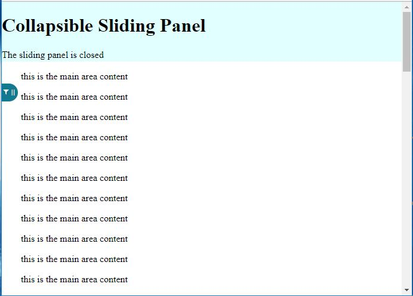
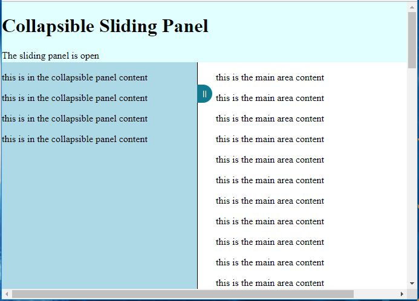

# Collapsible Sliding Panel

## Overview
The Collapsible Sliding Panel component used to show/hide contained elements.

[CHANGELOG.md](CHANGELOG.md) contains Release Notes for this package.

[CONTRIBUTING.md](CONTRIBUTING.md) contains guidelines on how to help improve this package.

## Using Collapsible Sliding Panel

The Collapsible Sliding Panel can be included as follows:

```
import {CollapsibleSlidingPanel} from 'collapsible-sliding-panel';

...

getSlidingPanelContent() {
  [some logic to build sliding panel content]
}

getMainPanelContent() {
  [some logic to build main panel content]
}

...

render () {
    ....
    return (
        <CollapsibleSlidingPanel
          slidingPanelClassName='collapsible-sliding-panel-classname'
          slidingPanelClosedClassName='collapsible-sliding-panel-is-closed-classname'
          expanderHandleClassName='collapsible-sliding-panel-expander-classname'
          slidingPanelContent={getSlidingPanelContent()}>
            {getMainPanelContent()}
        </CollapsibleSlidingPanel>
    )
}
```

## Configuring Collapsible Sliding Panel

The Collapsible Sliding Panel can be configured as follows

Property Name | Description
--------------|------------
slidingPanelClassName | The class name used for styling the sliding panel
slidingPanelClosedClassName | The class name used for styling the sliding panel when it is closed
expanderHandleClassName | The class name used for styling the expander handle
slidingPanelContent | The content that is to be rendered inside the sliding panel
collapseCallback | The callback function that is called when the sliding panel is expanded or collapsed

Style class names were added as properties for this component so that different styles could be assigned to different instances of the sliding panel within a single application.

When using the default styles, the 3 style class names mentioned above are combined in order to achieve the 'sliding/collapsing' effect as follows:

.slidingPanelClassName - how the sliding panel appears when it is expanded ... it also uses the CSS 'transition' property to determine it's expanding functionality
.slidingPanelClassName.slidingPanelClosedClassName - how the sliding panel appears when it is closed ... it also uses the CSS 'transition' property to determine it's collapsing functionality
.expanderHandleClassName - how the expander handle appears ... it also uses the CSS 'transition' property to determine how it moves when the sliding panel opens
.expanderHandleClassName.slidingPanelClosedClassName - how the expander handle appears when it is closed ... it also uses the CSS 'transition' property to determine how it moves when the sliding panel closes

## Run & Test Locally
The Collapsible Sliding Panel component can be launched independently in order to see/test it's capabilities as follows:

1. type the following NPM command from a comand prompt that supports NPM: npm run startDev
2. view the test app at the following URL: http://localhost:8005/collapsible-sliding-panel/

Once launched, the test application consists of the following components:

- header bar ... application title and text indicating whether the sliding panel is opened or closed
- sliding panel ... initially this panel is collapsed and it's content is not visible
- main content panel ... this is where the Collapsible Sliding Panel will render it's child elements (this.props.children)
- expander handle ... this 'tab' (depending on style assigned) is used to trigger the expanding and collapsing of the sliding panel

For the test application and using default styles, the Collapsible Sliding Panel looks like ths when collapsed:


For the test application and using default styles, the Collapsible Sliding Panel looks like ths when expanded:

